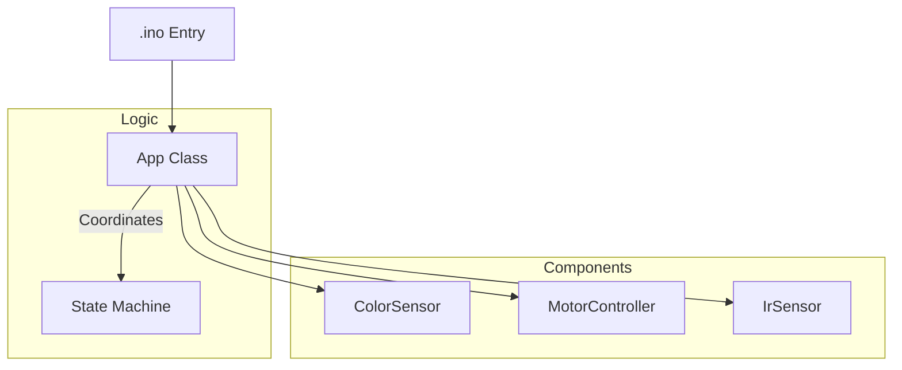

# Color-Controlled Motor System

A modular embedded C++ project for an Arduino-based motor control system driven by color detection and IR sensing.

## System Architecture

The project has been refactored from a monolithic sketch into a clean, component-based architecture following Staff Engineer standards.

### Component Diagram



### State Machine Logic

The system operates using a state machine to ensure predictable behavior:

| State | Condition | Action |
|-------|-----------|--------|
| **STOPPED** | Red Color Detected | Motors Idle |
| **RUNNING** | Green Color Detected | Forward or IR Maneuver |

While in the **RUNNING** state, the system performs real-time IR obstacle detection:
- **Path Clear:** Move Forward.
- **Obstacle Detected:** Execute alternative maneuver.

---

## Hardware Configuration

| Component | Pin(s) | Function |
|-----------|--------|----------|
| **TCS3200 S0-S1** | 4, 5 | Frequency Scaling |
| **TCS3200 S2-S3** | 6, 7 | Photodiode Type (RGB) |
| **TCS3200 OUT** | 2 | Frequency Input (Interrupt) |
| **IR Sensor** | 8 | Obstacle Detection |
| **Motor A** | 10, 11 | Speed/Direction Control |
| **Motor B** | 12, 13 | Speed/Direction Control |
| **Power Pins** | 14-19 | Pseudo VCC/GND for sensors |

---

## Project Structure

- `ColorS.ino`: Lightweight entry point.
- `include/Constants.h`: Centralized configuration for pins and thresholds.
- `src/App.h/.cpp`: Main application logic and state machine.
- `src/ColorSensor.h/.cpp`: Driver for the TCS3200 sensor.
- `src/MotorController.h/.cpp`: H-Bridge motor control abstraction.
- `src/IrSensor.h/.cpp`: Wrapper for the IR proximity sensor.

---

## Build and Installation

### Prerequisites
- Arduino IDE 2.0+ or PlatformIO.
- Arduino Uno/Nano or compatible board.

### Instructions
1. Clone the repository.
2. Open `ColorS.ino` in the Arduino IDE.
3. Ensure the `src` and `include` folders are in the same parent directory as `ColorS.ino`.
4. Select your board and port.
5. Click **Upload**.

---

## Calibration and Configuration

All "magic numbers" have been removed and replaced with named constants in `include/Constants.h`. To calibrate the system for your lighting conditions, modify the values in the `config::thresholds` namespace:

```cpp
namespace thresholds {
    constexpr int kRedGreenMin = 100;
    // ... adjust as needed
}
```

---

## Unit Testing

The project includes a host-based unit testing suite that uses a mock Arduino API. This allows for validating the state machine and logic without physical hardware.

### Running Tests (Local/Host)
If you have `g++` installed, you can compile and run the tests:

```powershell
# Compile the test suite
g++ -I tests -I include -I src tests/test_app.cpp tests/Arduino.cpp src/App.cpp src/ColorSensor.cpp src/MotorController.cpp src/IrSensor.cpp -o tests/run_tests.exe

# Run the tests
.\tests\run_tests.exe
```

### Coverage
- **App Initialization:** Verifies pin modes and power state.
- **State Logic:** Validates default stop behavior and transition requirements.
- **Hardware Mocking:** Uses a custom `tests/Arduino.h` to simulate physical I/O.

---

## Style Guide
This project follows the **Google C++ Style Guide** adapted for embedded systems, ensuring high readability and maintainability.
