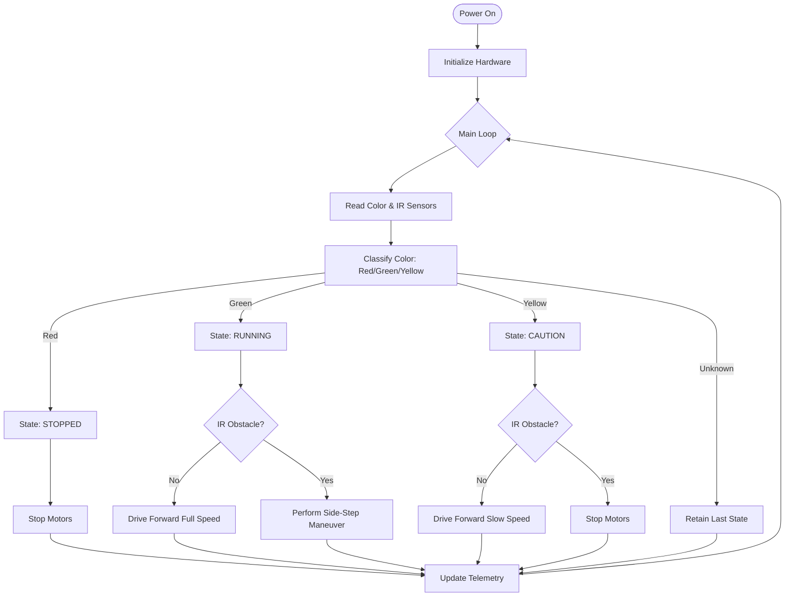

# Color-Controlled Motor System

A modular embedded C++ project for an Arduino-based motor control system driven by color detection and IR sensing.


---

## System Architecture

The project uses a clean, component-based architecture with a state machine at its core.

### Component Diagram

### System Flowchart


```mermaid
flowchart TD
    Start([Power On]) --> Init[Initialize Hardware]
    Init --> Loop{Main Loop}
    
    Loop --> ReadSensors[Read Color & IR Sensors]
    ReadSensors --> Classify[Classify Color: Red/Green/Yellow]
    
    Classify -- Red --> StopState[State: STOPPED]
    Classify -- Green --> RunState[State: RUNNING]
    Classify -- Yellow --> CautionState[State: CAUTION]
    Classify -- Unknown --> RetainState[Retain Last State]
    
    StopState --> StopMotors[Stop Motors]
    
    RunState --> CheckIRObstacle{IR Obstacle?}
    CheckIRObstacle -- No --> ForwardFull[Drive Forward Full Speed]
    CheckIRObstacle -- Yes --> SideStep[Perform Side-Step Maneuver]
    
    CautionState --> CheckIRObstacleCaution{IR Obstacle?}
    CheckIRObstacleCaution -- No --> ForwardSlow[Drive Forward Slow Speed]
    CheckIRObstacleCaution -- Yes --> StopMotorsCaution[Stop Motors]
    
    StopMotors --> Telemetry[Update Telemetry]
    ForwardFull --> Telemetry
    SideStep --> Telemetry
    ForwardSlow --> Telemetry
    StopMotorsCaution --> Telemetry
    RetainState --> Telemetry
    
    Telemetry --> Loop
```

### State Machine Logic

| State | Trigger Color | Motor Behaviour |
|-------|--------------|-----------------|
| **STOPPED** | Red | Motors idle (PWM = 0) |
| **CAUTION** | Yellow | Forward at reduced speed (`kSlow`) |
| **RUNNING** | Green | Forward at full speed; IR obstacle avoidance active |

While in the **RUNNING** state the system performs real-time IR obstacle detection:
- **Path Clear:** Move forward at full speed.
- **Obstacle Detected:** Execute alternative maneuver (side-step), then resume.

While in the **CAUTION** state:
- **Path Clear:** Move forward at reduced speed.
- **Obstacle Detected:** Stop immediately.

---

## Hardware Configuration

| Component | Pin(s) | Function |
|-----------|--------|----------|
| **TCS3200 S0–S1** | 4, 5 | Frequency Scaling (100%) |
| **TCS3200 S2–S3** | 6, 7 | Photodiode Filter (RGB select) |
| **TCS3200 OUT** | 2 | Frequency Input (Hardware Interrupt) |
| **IR Sensor** | 8 | Obstacle Detection (active-LOW) |
| **Motor A PWM** | 9 | Left Motor Speed |
| **Motor A Direction** | 10, 11 | Left Motor Direction |
| **Motor B PWM** | 3 | Right Motor Speed |
| **Motor B Direction** | 12, 13 | Right Motor Direction |
| **Power Pins** | 14–19 | Pseudo VCC / GND rails for sensors |

---

## Project Structure

```
Color-Controlled-Motor-System/
├── ColorS.ino                  # Lightweight Arduino entry point
├── include/
│   └── Constants.h             # Centralised pin, threshold, speed & timing config
├── src/
│   ├── App.h / App.cpp         # State machine & top-level orchestration
│   ├── ColorSensor.h / .cpp    # TCS3200 driver + color classification
│   ├── MotorController.h / .cpp# H-Bridge PWM motor control
│   ├── IrSensor.h / .cpp       # IR proximity sensor with debounce
│   └── Telemetry.h / .cpp      # Serial CSV + JSON telemetry output
├── tests/
│   ├── Arduino.h / Arduino.cpp # Arduino API mock (host-compatible)
│   ├── test_app.cpp            # App state machine tests
│   ├── test_sensor.cpp         # ColorSensor classification tests
│   ├── test_motor.cpp          # MotorController PWM/direction tests
│   └── test_ir.cpp             # IrSensor debounce & counter tests
└── .github/workflows/
    └── ci.yml                  # GitHub Actions CI pipeline
```

---

## Build and Installation

### Prerequisites
- Arduino IDE 2.0+ or PlatformIO
- Arduino Uno/Nano or compatible board (requires PWM on pins 3 and 9)

### Instructions
1. Clone the repository.
2. Open `ColorS.ino` in the Arduino IDE.
3. Ensure `src/` and `include/` are in the same directory as `ColorS.ino`.
4. Select your board and port.
5. Click **Upload**.

---

## Calibration and Configuration

All magic numbers are named constants in `include/Constants.h`.

```cpp
namespace config {

namespace thresholds {
    constexpr int kRedGreenMin  = 100;   // Adjust for your lighting
    constexpr int kYellowRedMin = 180;   // Yellow detection floor
    // ...
}

namespace speed {
    constexpr uint8_t kFull = 255;   // Full speed (RUNNING state)
    constexpr uint8_t kSlow = 140;   // Reduced speed (CAUTION state)
}

}  // namespace config
```

---

## Unit Testing

The project includes a host-based test suite using a custom Arduino mock (`tests/Arduino.h`). All tests compile and run on a standard PC — **no hardware required**.

### Running Tests Locally

Requires `g++` (MinGW on Windows, or any GCC-compatible compiler):

```powershell
# App state-machine tests
g++ -std=c++14 -Wall -Wextra -I tests -I include `
    tests/Arduino.cpp src/App.cpp src/ColorSensor.cpp `
    src/MotorController.cpp src/IrSensor.cpp src/Telemetry.cpp `
    tests/test_app.cpp -o tests/run_test_app.exe
.\tests\run_test_app.exe

# Color-Sensor classification tests
g++ -std=c++14 -Wall -Wextra -I tests -I include `
    tests/Arduino.cpp src/ColorSensor.cpp `
    tests/test_sensor.cpp -o tests/run_test_sensor.exe
.\tests\run_test_sensor.exe

# Motor-Controller PWM / direction tests
g++ -std=c++14 -Wall -Wextra -I tests -I include `
    tests/Arduino.cpp src/MotorController.cpp `
    tests/test_motor.cpp -o tests/run_test_motor.exe
.\tests\run_test_motor.exe

# IR-Sensor debounce tests
g++ -std=c++14 -Wall -Wextra -I tests -I include `
    tests/Arduino.cpp src/IrSensor.cpp `
    tests/test_ir.cpp -o tests/run_test_ir.exe
.\tests\run_test_ir.exe
```

### Test Coverage

| Suite | Cases | Covers |
|-------|-------|--------|
| `test_app` | 7 | Initialization, pin modes, state transitions (Red/Green/Yellow/Unknown), color labels |
| `test_sensor` | 5 | Red/Green/Yellow boundary classification, `map()` math, color labels |
| `test_motor` | 6 | Forward (full/slow), Reverse, TurnLeft, TurnRight, Stop — direction pins + PWM |
| `test_ir` | 3 | No-obstacle, debounce (reject then accept), trigger counter & reset |

---

## CI / CD Pipeline

GitHub Actions runs automatically on every **push** and **pull request** to `main`, `master`, or `develop`:

| Job | Tool | What it checks |
|-----|------|----------------|
| **Host Unit Tests** | `g++` | Compile + run all 4 test suites |

---

## Style Guide

This project follows the **Google C++ Style Guide** adapted for embedded systems, ensuring readability and maintainability across all components.
